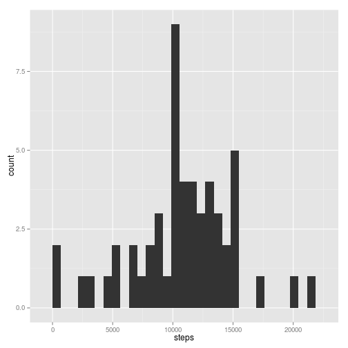
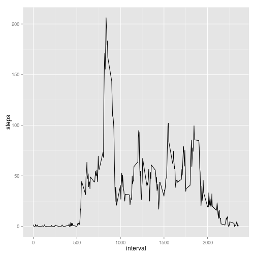
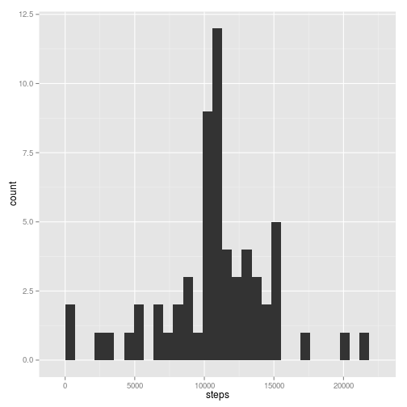
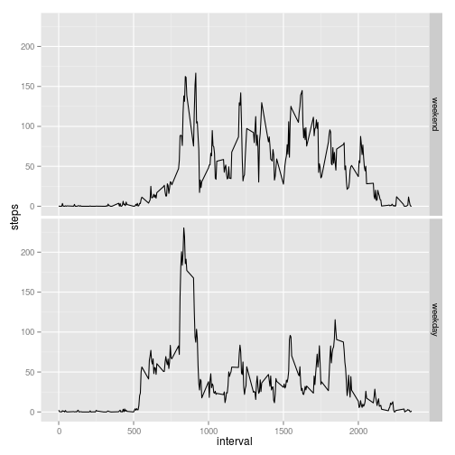

## Loading and preprocessing the data

The data is in vanilla csv, and is usable as is (we will
convert dates later, as needed.)


```r
stepData = read.csv("activity.csv")
```

## What is mean total number of steps taken per day?

First, compute total steps per day, and a histogram thereof:


```r
sumStepsPerDay = aggregate(steps ~ date, stepData, sum, na.rm=T)

library(ggplot2)
print(ggplot(data = sumStepsPerDay, aes(steps)) +
      geom_histogram()
     )
```

 

From the histogram, it seems that the center of the steps-per-day
distribution is somewhere around 10000 but let's be more precise and
get the actual mean and median:


```r
cat("Mean #steps per day is", 
    mean(sumStepsPerDay$steps, na.rm=T))
```

```
## Mean #steps per day is 10766.19
```

```r
cat("And median #steps per day is", 
    median(sumStepsPerDay$steps, na.rm=T))
```

```
## And median #steps per day is 10765
```

## What is the average daily activity pattern?

Let's look interval by interval (one interval is 5 minutes),
across days.


```r
intervalData= aggregate(steps ~ interval, stepData, mean, na.rm=T)

print(ggplot(data = intervalData, aes(x = interval, y = steps)) + 
      geom_line()
      )
```

 

What is the most active period, on average?


```r
largestAverage = which.max( intervalData$steps )
sprintf(
    "Interval #%d (i.e. %02d:%02d) has largest mean #steps (%.1f)",
    largestAverage,
    intervalData[largestAverage, "interval"] %/% 100,
    intervalData[largestAverage, "interval"] %% 100,
    intervalData[largestAverage, "steps"])
```

```
## [1] "Interval #104 (i.e. 08:35) has largest mean #steps (206.2)"
```

## Imputing missing values

There are many missing values...


```r
sum(is.na(stepData$steps))
```

```
## [1] 2304
```

... so we should might see how things change if we impute values instead.
A very simple approach is to give every missing period in a day
the average number of steps for that period from other days.
(We already have the average steps per period computed from above;
fortunately, as verified below, we have some data for each period.)


```r
stepDataFull = stepData # this will be a copy with imputed values

stopifnot(!any(is.na(intervalData$steps))) # verify there's always an average

for (i in 1:nrow(stepDataFull)) {
  if (is.na(stepData[i,"steps"]))  {
      stepDataFull[i, "steps"] =
      # select appropriate value from the intervalData averages
      intervalData[intervalData$interval == stepData[i,"interval"], "steps"]
  }
  else {
      stepDataFull[i, "steps"] =  stepData[i, "steps"]
  }
 }
```

Let's plot the "full" data instead (with imputed values) and, as
before, look at the mean and median.


```r
sumStepsPerDayFull = aggregate(steps ~ date, stepDataFull, sum, na.rm=T)

print(ggplot(data = sumStepsPerDayFull, aes(steps)) +
      geom_histogram()
     )
```

 

```r
cat("Mean #steps per day with imputation is", 
    mean(sumStepsPerDayFull$steps, na.rm=T))
```

```
## Mean #steps per day with imputation is 10766.19
```

```r
cat("And median #steps per day with imputation is", 
    median(sumStepsPerDayFull$steps, na.rm=T))
```

```
## And median #steps per day with imputation is 10766.19
```

The mean number of steps hasn't changed. What a remarkable
coincidence!  Actually, this is understandable: what has happened is
that every day either has all values provided or none at all, so that
the none-at-all days are being treated as an average day in every
single period: thus the overall daily average does not change (we are
essentially adding more data points with the pre-existing average.)
For the same reason we would expect the median, if it changes at all,
to shift towards the mean: in fact, it was close to the mean to begin
with, and now it matches exactly (and so the median day will be one of the
eight none-at-all days whose values were imputed throughout.)

## Are there differences in activity patterns between weekdays and weekends?

Let's add a day of week factor and then, based on that,
a boolean factor distinguishing weekends from weekdays:


```r
stepDataFull$dow = weekdays(strptime(stepDataFull$date, format="%Y-%m-%d"))
stepDataFull$dowtype =
    factor(stepDataFull$dow == "Saturday" | stepDataFull$dow == "Sunday",
           levels=c(TRUE, FALSE),
           labels=c("weekend", "weekday"))
```

Plotting these seperate is a good way of eye-balling whether
weekends and weekdays are different:


```r
meanStepsPerInterval2 =
    aggregate(steps ~ interval * dowtype,
        stepDataFull,
        mean,
        na.rm=T)

print(ggplot(data = meanStepsPerInterval2, aes(x=interval, y = steps)) +
      geom_line() +
      facet_grid(dowtype~.)
     )
```

 

On the face of it, weekdays have a larger peak in the morning at about
8:30am (walkingto work?), and activity tends to starts earlier (does
the subject wake up earlier on week days?), but after the morning
there is less activity throughout the rest of the day compared to the
weekends and perhaps a slightly earlier cessation of activity (going
to bed a bit earlier?). You'd need more analysis to see if this
pattern was "real" but it stands out fairly clearly in the graphs and
makes some sense, so we shouldn't be surprised if it stands up to
deeper scrutiny.


